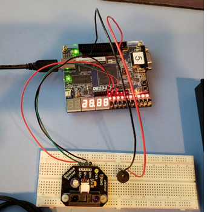
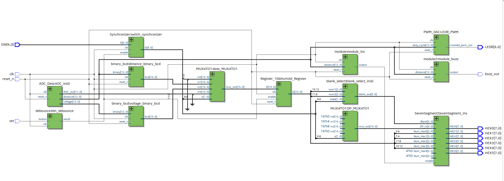
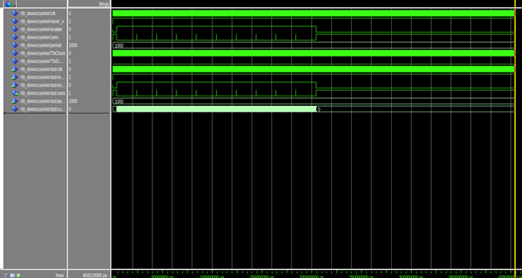
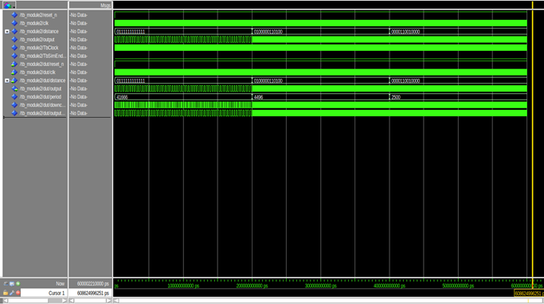
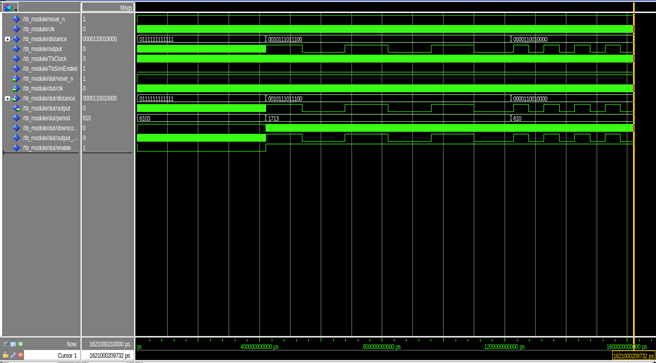
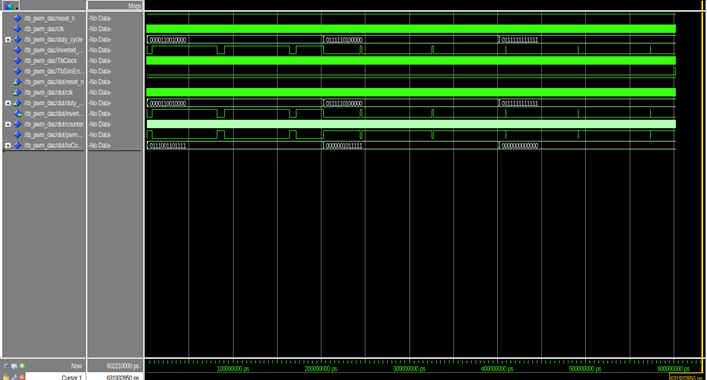
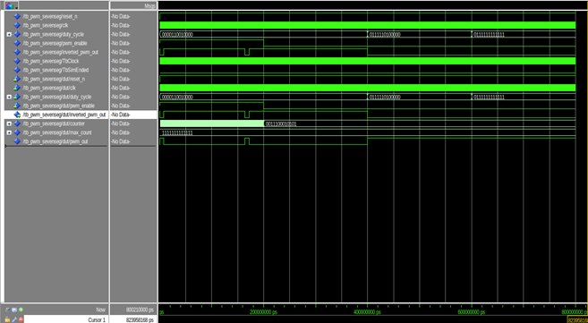
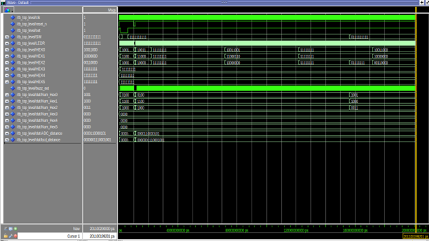

# Ultrasonic Parking Sensor with PWM Alerts

## Table of Contents
1. [Introduction](#introduction)  
2. [Project Overview](#project-overview)  
3. [Hardware Requirements](#hardware-requirements)  
4. [System Architecture](#system-architecture)  
5. [Module Summaries](#module-summaries)  
   1. [Top-Level](#1-top-level)  
   2. [ADC_Data](#2-adc_data)  
   3. [PWM_DAC](#3-pwm_dac)  
   4. [module (7-Segment Flashing)](#4-module-7-segment-flashing)  
   5. [module2 (Buzzer Tone)](#5-module2-buzzer-tone)  
   6. [downcounter](#6-downcounter)  
   7. [PWM_SEVENSEG](#7-pwm_sevenseg)  
   8. [SevenSegment & SevenSegment_decoder](#8-sevensegment--sevensegment_decoder)  
   9. [Synchronizer & Register_10bits](#9-synchronizer--register_10bits)  
   10. [binary_bcd (voltage_binary_bcd)](#10-binary_bcd-voltage_binary_bcd)  
6. [Build & Simulation Instructions](#build--simulation-instructions)  
7. [Usage](#usage)  
8. [Test Bench & Demo Videos](#test-bench--demo-videos)  
   1. [Simulation Test Benches](#1-simulation-test-benches)  
9. [Troubleshooting](#troubleshooting)  
10. [License](#license)  
11. [Contact](#contact)

---

## Introduction
This project implements a **parking sensor** system on the **DE10-Lite FPGA board** using an ultrasonic distance sensor. It provides:
- **Distance-Based LED Brightness** (via PWM)  
- **Distance-Based 7-Segment Flashing** (faster flash as target gets closer)  
- **Distance-Based Buzzer Tone** (higher pitch as target nears)


**Setup**
This is what the test setup should look like


**Demo**
This is a video of the DE10-Lite board with the ultrasonic sensor and buzzer. Demonstrate the LED brightness changing, 7-seg flashing, and buzzer pitch variations as the sensor detects distance changes.
[](https://youtu.be/hazvd3pE4nA)


---

## Project Overview
1. **Distance Sensor**: Feeds ADC input, providing raw 12-bit data and an averaged output.  
2. **PWM Control**: Adjusts LED brightness, 7-segment flash rate, and buzzer frequency based on distance.  
3. **Binary-to-BCD**: Converts numerical data to display on the DE10-Lite’s 7-segment LEDs.  
4. **Synchronization**: Switch inputs are synchronized to the system clock, preventing metastability.

---

## Hardware Requirements
1. **DE10-Lite FPGA Board**  
2. **Ultrasonic Sensor** (e.g., HC-SR04)  
3. **Buzzer** (piezo or magnetic)  
4. **Breadboard & Jumper Wires**  
5. **Optional**: External pushbutton for reset or mode selection

Ensure correct pin assignments in `.QSF`. Check sensor specs for power and signal levels.

---

## System Architecture

```
+------------------------------+        +------------------+
| Distance Sensor (Ultrasonic)| --->   |  ADC_Data (FPGA) |
|  - Output: Echo, Input: Trig|        |     - ADC_raw    |
|                              |        |     - voltage    |
+--------------+---------------+        |     - distance   |
               |                        +--------+---------+
               |                                 |
               v                                 v
    +------------------+           +------------------------+
    |  binary_bcd     |           |  PWM Modules           |
    | (voltage/distance->BCD)     |  (LED brightness,      |
    +------------------+           |   buzzer, 7-seg flash) |
               |                   +---------+--------------+
               v                             |
    +-----------------------------+           |
    |  SevenSegment Displays     | <-- Flash control (PWM)   
    +-----------------------------+                     
    +--------------+-----------------------------------+
    | Buzzer (tone)| <---------- Distance-based PWM     |
    +--------------+
```

**RTL Viewer**  
After compilation, you can open the **RTL Viewer** in Quartus to visualize how these modules connect.  
 
**RTL View Output**:  
  

---

## Module Summaries

### 1. Top-Level
**File**: `top_level.vhd`  
- Wires together **ADC_Data**, **debounce**, **Synchronizer**, **binary_bcd**, **MUX4TO1**, **Register_16bits**, **PWM_DAC**, **module**, **module2**, and the **SevenSegment** logic.  
- Routes distance signals for LED brightness, buzzer frequency, and 7-segment flashing.

### 2. ADC_Data
**File**: `ADC_Data.vhd`  
- Reads from the MAX10 ADC (or simulation model).  
- Outputs **voltage** (in mV) and **distance** (in 10^-4 cm).  
- Uses `averager256` to stabilize the 12-bit ADC readings.

### 3. PWM_DAC
**File**: `PWM_DAC.vhd`  
- Generates a **PWM** waveform for **LED brightness**.  
- Increments an internal counter each clock cycle, comparing against `duty_cycle`.  
- Outputs an inverted signal for active-low LED usage.

### 4. module (7-Segment Flashing)
**File**: `module.vhd`  
- Manages the **7-segment flashing** rate using a **downcounter**.  
- If distance < 20 cm, flashing is enabled and gets faster as distance decreases.  
- Otherwise, flashing is disabled (steady display).

### 5. module2 (Buzzer Tone)
**File**: `module2.vhd`  
- Similar structure to `module`, but for generating a **variable-frequency buzzer** tone.  
- Feeds a `downcounter` with a period derived from the distance, toggling the buzzer output more rapidly as the target approaches.

### 6. downcounter
**File**: `downcounter.vhd`  
- Counts from `period-1` to 0, asserting a single-cycle pulse on `zero` each time it reaches 0.  
- If `enable='0'`, it halts counting and holds `zero='1'`.

### 7. PWM_SEVENSEG
**File**: `PWM_SEVENSEG.vhd`  
- A specialized PWM that increments its counter **only** when `pwm_enable='1'`.  
- Compares `counter` to a (possibly small) `duty_cycle` to control flash or tone duty.  
- Outputs an inverted PWM signal.

### 8. SevenSegment & SevenSegment_decoder
**Files**: `SevenSegment.vhd`, `SevenSegment_decoder.vhd`  
- **SevenSegment**: Instantiates one decoder per display (HEX0..5), handling blanking logic.  
- **SevenSegment_decoder**: Converts a 4-bit nibble into segment data `{DP, g, f, e, d, c, b, a}` (active-low).

### 9. Synchronizer & Register_10bits
**Files**: `Synchronizer.vhd`, `Register_10bits.vhd`  
- Brings asynchronous **switch inputs** (`SW`) into the system clock domain safely.  
- Uses two stages of 10-bit registers to reduce metastability risk.

### 10. binary_bcd (voltage_binary_bcd)
**File**: `binary_bcd.vhd`  
- Converts a 13-bit binary number to a 16-bit **BCD** value using the **shift-and-add-3** algorithm.  
- An FSM (states S0..S6) iterates 12 times, producing the final BCD for display.

---

## Build & Simulation Instructions

1. **Clone/Download Repository**  
   - Acquire the `.vhd` files along with the Quartus project files (`.qpf`, `.qsf`).

2. **Open in Quartus Prime**  
   - Open the `.qpf`.  
   - Check **Pin Planner** or `.qsf` for correct pin mappings.

3. **Compile**  
   - Go to **Processing** → **Start Compilation**.  
   - Resolve any errors or warnings.

4. **Simulation (Optional)**  
   - For functional verification, create testbenches in ModelSim or another simulator.  
   - Check waveforms for modules like `PWM_DAC`, `binary_bcd`, `downcounter`, etc.

5. **Program the DE10-Lite**  
   - Tools → Programmer → Select `.sof`.  
   - Verify FPGA is powered and recognized by USB-Blaster.

6. **View RTL (Optional)**  
   - Tools → Netlist Viewers → RTL Viewer.  
   - Inspect your design hierarchy visually.

---

## Usage

1. **Power On**  
   - Supply power to DE10-Lite via USB or external.  
   - Ensure the ultrasonic sensor and buzzer are connected.

2. **Watch Outputs**  
   - **LEDR**: Modulates brightness based on distance.  
   - **7-Seg Displays**: Show numeric data (distance or voltage) and flash below ~20 cm.  
   - **Buzzer**: Audible tone that grows higher in frequency as distance shrinks.

3. **Switches & Button**  
   - If your top-level design uses switches (`SW`), toggling them might change display modes.  
   - Pressing a `set` or pushbutton (debounced) can store new values or enable specific modes.

4. **Reset (if applicable)**  
   - If you implemented a `reset_n`, pressing it resets the internal registers/counters.  
   - Upon release, the system restarts from default.


### 1. Simulation Test Benches

#### Simulation Snapshots


> *Figure: Down Counter Simulation*


> *Figure: Module 2 Simulation*


> *Figure: Module Simulation*


> *Figure: PWM DAC Simulation*


> *Figure: PWM Seven-Segment Simulation*


> *Figure: Top-Level Simulation*

[](https://youtu.be/_nQB8vx5xzw)

---

In the snippet above:

- Each image is placed under the `#### Simulation Snapshots` heading.
- The path `media/<filename>.png` is used to reference the images stored in the `media` folder.
- A short figure caption is provided after each image in blockquote format for clarity (optional but often helpful).

Feel free to rearrange these images under specific subheadings if they correspond to particular test benches.

---

## Troubleshooting

- **LED Always Off or Fully On**  
  - Check `duty_cycle` range in `PWM_DAC`. Ensure `distance` is valid.  
  - Verify the LED pins or whether they’re active-low or active-high.

- **No Buzzer Tone**  
  - Confirm `.qsf` pin assignment to the buzzer line.  
  - Check buzzer polarity or if a transistor driver is needed.

- **7-Segment Doesn’t Flash**  
  - Verify the `module` logic and the threshold (distance < 20 cm).  
  - Ensure `pwm_enable` toggles in the `PWM_SEVENSEG`.

- **Distance Reading Incorrect**  
  - Check sensor wiring (Echo, Trig).  
  - Inspect `ADC_Data` conversions (voltage -> distance).  
  - Verify you’re using the correct reference voltage or a 2:1 divider.

---


## Contact
Created by **Yazan**  
Email: [ychama15@gmail.com](mailto:ychama15@gmail.com)  
 
Questions, suggestions, or contributions? Feel free to reach out or open an issue!

---

*Enjoy experimenting with the Ultrasonic Parking Sensor, whether you’re viewing waveforms in simulation or capturing real-world data with the DE10-Lite board!*
